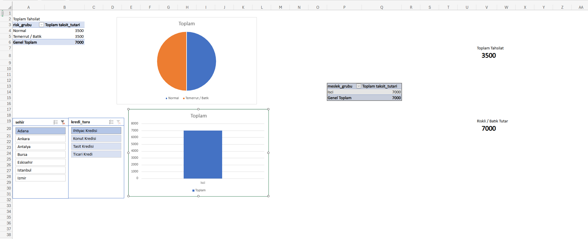

# 📊 Kredi Risk Analitiği & Portföy Performans Paneli

## 📌 Proje Özeti
Bu çalışma; müşteri demografisi, kredi detayları ve taksit geri ödeme verilerini entegre ederek kredi portföyünün temerrüt (default) ve gecikme dinamiklerini inceleyen uçtan uca bir veri analitiği projesidir. Ham ilişkisel veritabanı verileri **SQL** ile modellenmiş ve temizlenmiş; ardından **Excel** ortamında dinamik bir **Yönetici Risk Paneli** haline getirilmiştir.

---

## 🛠️ Kullanılan Teknolojiler & Beceriler
* **SQL:** İlişkisel tabloları birleştirme (INNER JOIN), iş mantığına dayalı risk sınıflandırması (CASE WHEN), agregasyon fonksiyonları (SUM, COUNT), gruplama (GROUP BY).
* **Excel:** Pivot Tablolar, Dilimleyiciler (Slicers), Rapor Bağlantıları (Report Connections), Hücre Tabanlı Dinamik KPI Kartları, Veri Görselleştirme (2B Pasta ve Sütun Grafikleri).

---

## 🧱 Veri Mimarisi & Modelleme

### Tablolar & İlişkiler
* `musteriler`: musteri_id, sehir, meslek_grubu
* `krediler`: kredi_id, musteri_id, kredi_turu, ana para tutarı, vade
* `taksitler`: taksit_id, kredi_id, taksit_tutari, odenmis_taksit_tutari, gecikme_gun_sayisi

### Risk Sınıflandırma Mantığı (CASE WHEN)
Taksit bazındaki gecikme günlerine (`gecikme_gun_sayisi`) göre portföy şu şekilde segmentlere ayrılmıştır:
* **0 - 30 Gün:** Normal / Düşük Risk
* **31 - 90 Gün:** Riskli / Yakın İzleme
* **90+ Gün:** Batık / Temerrüt (NPL)

---

## 📈 Dashboard Mimarisi

### 1. Dinamik Yönetici KPI Kartları
* **Toplam Tahsilat:** Portföyde başarıyla tahsil edilen toplam nakit tutarı (`odenmis_taksit_tutari` genel toplamı).
* **Riskli / Batık Tutar:** Gecikmeye düşmüş veya temerrüt riski taşıyan toplam para miktarı.

### 2. Görsel Dağılım Grafikleri
* **Portföy Risk Dağılımı (2B Pasta Grafik):** Portföyün risk segmentlerine göre oransal ağırlığı.
* **Meslek Grubu Bazlı Hacim Analizi (2B Kümelenmiş Sütun Grafik):** Meslek segmentlerine göre toplam tahsilat tutarları.

### 3. Dinamik Filtreleme (Dilimleyiciler / Slicers)
* `sehir` ve `kredi_turu` dilimleyicileri **Rapor Bağlantıları** üzerinden tüm Pivot tablolara bağlanmıştır. Tek bir filtre seçimiyle hem grafikler hem de üstteki KPI kartları senkronize biçimde filtrelenir.

---

## 📂 Dosya Yapısı
* `credit_risk_query.sql`: Tabloları birleştiren ve risk gruplarını hesaplayan ana SQL sorgusu
* `credit_risk_dashboard.xlsx`: Pivot tablolar, KPI kartları ve grafikleri içeren analitik çalışma kitabı
* `dashboard.png`: Yönetici panelinin ekran görüntüsü
* `README.md`: Proje dokümantasyonu

---

## 🔍 Temel Analitik Çıkarımlar
* **Meslek Dağılımı Riski:** Belirli meslek gruplarında tahsilat hacmi yüksek görünse de gecikme sürelerinin yoğunlaştığı gözlemlenmiştir. Bu segmentlere yönelik kredi tahsis süreçlerinde ek teminat kriterleri önerilir.
* **Ürün Segmentasyonu:** Kredi türüne göre filtreleme yapıldığında temerrüt hacminin hangi ürün grubunda kümelendiği dinamik olarak izlenebilmektedir.
